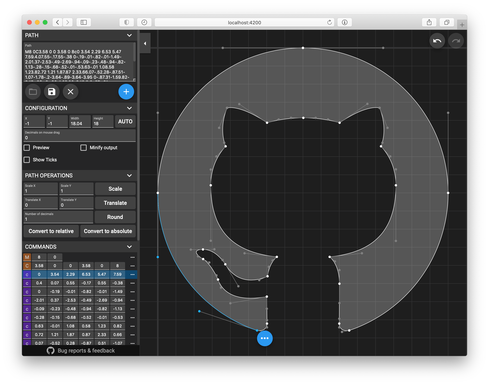

# SvgPathEditor
Edit or create SVG paths in browser: https://yqnn.github.io/svg-path-editor/

## How to Use

##### Basic:
- Paste or edit the raw path in the **path** field
- Click on **+** to add a new command to the path, select a type, then click on the destination
- Move points with drag and drop
- Click on a point, then on the **...** button to insert a command right after the selected one, to remove it, or to change its type

##### Commands panel:
- Click on the command type to toggle between relative and absolute coordinates
- Relative command types are **orange**, absolute are **purple**
- Click on **...** then **Delete** to delete a command
- Click on **...** then **Insert after** to insert a new command right after the selected one
- Click on **...** then **Convert to** to convert the selected command to a new type

##### ViewBox:
- Use mouse wheel, or click **Zoom in** and **Zoom out** to zoom in/out
- Use drag & drop to move the viewBox
- Click on **Zoom to Fit** to automatically set the viewBox depending on current path
- ViewBox can also be set manually with the **x**, **y**, **width** and **height** fields

##### Path operations:
- Scale the full path with the **Scale** button
- Translate the full path with the **Translate** button
- Rotate the full path with the **Rotate** button
- Round all coordinates of the current path with the **Round** button
- Convert all commands to relative or absolute coordinates with **Convert to relative** or **Convert to absolute** button

##### Shortcuts:
- Press **m**, **l**, **v**, **h**, **c**, **s**, **q**, **t**, **a** or **z** to insert a command after the selected one
- Press **shift** + **m**, **l**, **v**, **h**, **c**, **s**, **q**, **t**, **a** or **z** to convert selected command to a new type
- Press **echap** to delete the command being created, or the undo the current dragging operation
- Press **delete** or **backspace** to delete the selected command
- Press **ctrl** + **z** or **cmd** + **z** to undo
- Press **ctrl** + **shift** + **z** or **cmd** + **shift** + **z** to redo
- Press **ctrl** while dragging to ignore `snap to grid` constraint

## Running Locally

### With Node.js

##### Requirements
- [Node.js](https://nodejs.org/) v12.14, v14.15 or higher.

##### Dependencies
Run `npm install` to retrieve all the depencies of the project.

##### Development server
Run `npm start` for a dev server. Navigate to `http://localhost:4200/`. The app will automatically reload if you change any of the source files.

##### Build
Run `npm run build` to build the project. The build artifacts will be stored in the `dist/` directory.

##### Running unit tests
Run `npm test` to execute the unit tests via [Karma](https://karma-runner.github.io).

### With Docker
Run `docker build -t svg-path-editor . && docker run -p 4200:4200 svg-path-editor` or `docker-compose up`.

## Special Thanks
Many thanks to our sponsors 🙇 !

[@riovir](https://github.com/riovir), [@miniBill](https://github.com/miniBill), [@GitHub](https://github.com/GitHub), [@alexandernst](https://github.com/alexandernst), [@Filimoa](https://github.com/Filimoa), [@agrogers](https://github.com/agrogers), [@MilesTails01](https://github.com/MilesTails01), [@robetus](https://github.com/robetus), [@adcar](https://github.com/adcar), [@getsentry](https://github.com/getsentry), [@simplicitywebdesign](https://github.com/simplicitywebdesign) 😎